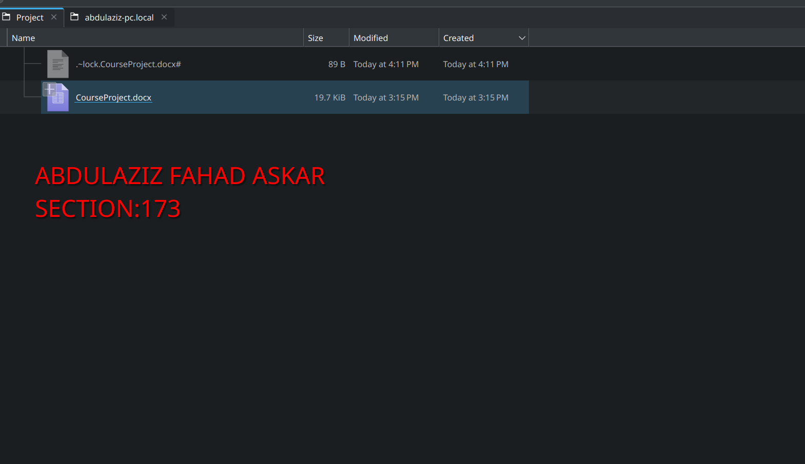

# InfoSec Project

## Task 2
Inputs :
```sh
password="password"
input_file="plaintext.txt"
```
### AES-128

#### Encryption
This is the Simple option using openssl directly in the script
```sh
echo "AES 128 Encryption Started"

openssl enc -aes-128-cfb -in "$input_file" -out "cipher-Aes128-CFB.bin" -pass pass:"$password" -pbkdf2
cat "cipher-Aes128-CFB.bin"
echo ""
openssl enc -aes-128-ofb -in "$input_file" -out "cipher-Aes128-OFB.bin" -pass pass:"$password" -pbkdf2
cat "cipher-Aes128-OFB.bin"
echo ""
openssl enc -aes-128-cbc -in "$input_file" -out "cipher-Aes128-CBC.bin" -pass pass:"$password" -pbkdf2
cat "cipher-Aes128-CBC.bin"
echo ""
echo "AES 128 Encryption Over"
```
This is the Programatic Option using loops
```sh

if [ ! -f "$input_file" ]; then
    echo "Error: Input file $input_file not found"
    exit 1
fi

needs_legacy_provider() {
    local cipher=$1
    case $cipher in
        "bf-cfb"|"bf-ofb"|"bf-cbc")
            return 0 ;;
        *)
            return 1 ;;
    esac
}

encrypt_file() {
    local cipher=$1
    local output=$2
    
    local provider_flag=""
    if needs_legacy_provider "$cipher"; then
        provider_flag="-provider legacy -provider default"
    fi
    
    if openssl enc -"$cipher" \
        $provider_flag \
        -in "$input_file" \
        -out "$output" \
        -pass pass:"$password" \
        -pbkdf2; then
        echo "Encrypted with $cipher"
        cat "$output"
        echo ""
    else
        echo "Encryption failed for $cipher"
        return 1
    fi
}


echo "Begin Encryption"

# AES Encryption
echo "AES 128 Encryption Started"

encrypt_file "aes-128-cfb" "cipher-Aes128-CFB.bin"
encrypt_file "aes-128-ofb" "cipher-Aes128-OFB.bin"
encrypt_file "aes-128-cbc" "cipher-Aes128-CBC.bin"

echo "AES 128 Encryption Over"

```
#### Decryption
```sh
# AES-128 Decryption
echo "AES 128 Decryption Started"

openssl enc -d -aes-128-cfb -in "cipher-Aes128-CFB.bin" -out "cipher-Aes128-CFB_decrypted.txt" -pass pass:"$password" -pbkdf2
cat "cipher-Aes128-CFB_decrypted.txt"
echo ""

openssl enc -d -aes-128-ofb -in "cipher-Aes128-OFB.bin" -out "cipher-Aes128-OFB_decrypted.txt" -pass pass:"$password" -pbkdf2
cat "cipher-Aes128-OFB_decrypted.txt"
echo ""

openssl enc -d -aes-128-cbc -in "cipher-Aes128-CBC.bin" -out "cipher-Aes128-CBC_decrypted.txt" -pass pass:"$password" -pbkdf2
cat "cipher-Aes128-CBC_decrypted.txt"
echo ""

echo "AES 128 Decryption Over"
```

This is the Programatic Option using loops
```sh

needs_legacy_provider() {
    local cipher=$1
    case $cipher in
        "bf-cfb"|"bf-ofb"|"bf-cbc")
            return 0 ;;
        *)
            return 1 ;;
    esac
}

decrypt_file() {
    local cipher=$1
    local input=$2
    local output="${input%.bin}_decrypted.txt"
    
    local provider_flag=""
    if needs_legacy_provider "$cipher"; then
        provider_flag="-provider legacy -provider default"
    fi
    
    if [ ! -f "$input" ]; then
        echo "Error: Input file $input not found"
        return 1
    fi
    
    if openssl enc -d -"$cipher" \
        $provider_flag \
        -in "$input" \
        -out "$output" \
        -pass pass:"$password" \
        -pbkdf2; then
        echo "Decrypted $input with $cipher"
        echo "Output saved to $output"
        echo "Content:"
        cat "$output"
        echo ""
    else
        echo "Decryption failed for $cipher"
        return 1
    fi
}

echo "Begin Decryption"

# AES Decryption
echo "AES 128 Decryption Started"

decrypt_file "aes-128-cfb" "cipher-Aes128-CFB.bin"
decrypt_file "aes-128-ofb" "cipher-Aes128-OFB.bin"
decrypt_file "aes-128-cbc" "cipher-Aes128-CBC.bin"

echo "AES 128 Decryption Over"
```

### Blowfish

#### Encryption
This is the Simple option using openssl directly in the script
```sh
# Blowfish Encryption
echo "BlowFish Encryption Started"

openssl enc -bf-cfb -provider legacy -provider default -in "$input_file" -out "cipher-BlowFish-CFB.bin" -pass pass:"$password" -pbkdf2
cat "cipher-BlowFish-CFB.bin"
echo ""

openssl enc -bf-ofb -provider legacy -provider default -in "$input_file" -out "cipher-BlowFish-OFB.bin" -pass pass:"$password" -pbkdf2
cat "cipher-BlowFish-OFB.bin"
echo ""
openssl enc -bf-cbc -provider legacy -provider default -in "$input_file" -out "cipher-BlowFish-CBC.bin" -pass pass:"$password" -pbkdf2
cat "cipher-BlowFish-CBC.bin"
echo ""
echo "BlowFish Encryption Over"
```
This is the Programatic Option using loops it is done on the same file as the AES one so i'll just put the function calls 
```sh
echo "BlowFish Encryption Started"

encrypt_file "bf-cfb" "cipher-BlowFish-CFB.bin"
encrypt_file "bf-ofb" "cipher-BlowFish-OFB.bin"
encrypt_file "bf-cbc" "cipher-BlowFish-CBC.bin"

echo "BlowFish Encryption Over"
```

#### Decryption

This is the Simple option using openssl directly in the script

```sh
# Blowfish Decryption
echo "BlowFish Decryption Started"

openssl enc -d -bf-cfb -provider legacy -provider default -in "cipher-BlowFish-CFB.bin" -out "cipher-BlowFish-CFB_decrypted.txt" -pass pass:"$password" -pbkdf2
cat "cipher-BlowFish-CFB_decrypted.txt"
openssl enc -d -bf-ofb -provider legacy -provider default -in "cipher-BlowFish-OFB.bin" -out "cipher-BlowFish-OFB_decrypted.txt" -pass pass:"$password" -pbkdf2
cat "cipher-BlowFish-OFB_decrypted.txt"
openssl enc -d -bf-cbc -provider legacy -provider default -in "cipher-BlowFish-CBC.bin" -out "cipher-BlowFish-CBC_decrypted.txt" -pass pass:"$password" -pbkdf2
cat "cipher-BlowFish-CBC_decrypted.txt"
echo ""
echo "BlowFish Decryption Over"
```

This is the Programatic Option using loops but same as above i'll just place the function calls
```sh
# Blowfish Decryption
echo "BlowFish Decryption Started"

decrypt_file "bf-cfb" "cipher-BlowFish-CFB.bin"
decrypt_file "bf-ofb" "cipher-BlowFish-OFB.bin"
decrypt_file "bf-cbc" "cipher-BlowFish-CBC.bin"

echo "BlowFish Decryption Over"
```

## Task 3

### Bash Script

```sh
# Encryption
openssl enc -aes-128-cbc -in $picture -out pic_cbc.bmp -pass pass:"password" -pbkdf2

openssl enc -aes-128-ecb -in $picture -out pic_ecb.bmp -pass pass:"password" -pbkdf2

# Valid image header
head -c 54 $picture > imgheader

# removed invalid Image header
tail -c +55 pic_ecb.bmp > ecbbody

tail -c +55 pic_cbc.bmp > cbcbody

# Appended the encrypted image data to the valid header
cat imgheader ecbbody > pic_ecb.bmp

cat imgheader cbcbody > pic_cbc.bmp
# Cleaning 
rm imgheader 

rm ecbbody

rm cbcbody

```

### Input / Output
#### Given Picture
Here is the Input Picture


and here is the output :


#### Custom Picture

I needed to Convert to a bmp file since pngs and bmps have different header sizes which would make the script more complex so i elected to convert the file instead 
this is the converted file 


This is the Output after Encryption


### Summary
As you can See the ECB Picture still shows the Outline some would say the general feeling of the picture but CBC completly Garbles how it looks such that you can't deduce the original picture shape from it

so in summary CBC is better for encrypting the image for secrecy


## Challenges Faced
### Installing the Correct Openjdk 

I only Had the JRE OpenJDK package not the devel version which required me to google as to why javac was not found here is the error 
```sh
bash: javac: command not found...
Similar command is: 'java'    
```
### Virtual Box Wasn't Available in the Package manager 
Virtual Box wasn't available to install in my package manager so i had to use my baremetal machine to conduct the project

### Forgetting the Echo

Since sometimes the Encryption uses the newline character i had to include the Echo new line to make it so that when the encryption is catted they don't appear on top of one another 

### incredibly verbose erroring in the terminal

When conducting Task 7 I had a lot of Verbose unneccary errors popping up why was that 
it was because i didn't place the Encryption code in a try catch with the exception being the `javax.crypto.BadPaddingException`

### Silent Failure on no key

If they Key wasn't found the Program Will just error and not tell me it had ended so to solve that i made a new class which is a custom exception called `NoKeyFoundException`


## The Code
The Code and the Script are in this Github [repo](https://github.com/abo3skr2019/InfoSecProject)
